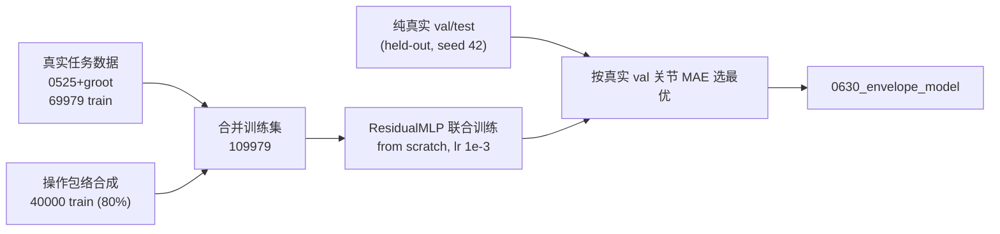

# IKNET 泛化性提升报告：操作包络合成数据增强

**日期**：2026-06-30
**测试对象**：`END2JOINT` 的 IKNET（`ResidualMLP` 26→14）训练管线
**目的**：在**不改动网络结构、不牺牲 in-distribution 精度**的前提下，提升 endpose→joint 转换器对**分布外（OOD）末端位姿**的泛化能力，专门针对 `IKNET_TEST_REPORT_zh.md` §7.4.7 暴露的失败案例（未见大幅度动作 ep001，纯网络末端误差 44mm）。

---

## 1. 背景与动机

`IKNET_TEST_REPORT_zh.md` §7.4.7 发现：在两条**全新采集、模型完全未见**的 episode 上，
- **ep000（小幅度）**：纯网络末端 ~13.5mm，fk=2 即闭合。
- **ep001（右臂大幅度，偏 OOD）**：纯网络末端 **44mm**，fk=2 收不住（残留 32mm），需 fk=15 才闭合到 0.08mm。

根因：IKNET 只在任务录制数据（task-concentrated）上训练，关节空间大片区域属 OOD，网络外推差。本报告的目标即**从训练数据层面缩小这一外推缺口**，让纯网络在 OOD 上的初值更好，降低对大量 fk 迭代的依赖。

**硬约束**：不得劣化当前 in-distribution 精度（held-out 真实 test，纯网络 ~1.12° / 8.6mm）。

> 评测口径：全部沿用报告 §7.4.7 的 **model-only（IKNET-only，不含 fk_correction）+ gt-prev** round-trip。基线模型为已部署的 `0629_groot85`（`ik_net/0629_groot85_model/`）。在本仓库同一 8:1:1 划分（`seed=42`）下，基线纯网络 held-out test = **1.116° / 8.603mm**，ep000=13.5mm，ep001=44.3mm —— 与报告 §7.4.7 一致，确认评测可信。

---

## 2. 问题诊断：ep001 的 OOD 几何定位

把 ep001 每帧的 14 关节相对**真实训练分布**做 z-score，并统计落在训练 `[min,max]` 之外的比例：

| 关节 | 真实范围(°) | 真实 std(°) | ep001 范围(°) | max\|z\| | % 出界 |
|------|------------|------------|---------------|---------|--------|
| 左臂 7 关节 | — | — | — | ≤1.2 | **0%** |
| R_sh_pitch | [-36.5, 49.8] | 23.6 | [-32.5, **70.1**] | 2.7 | 33% |
| R_sh_roll | [-20.7, 25.0] | 10.5 | [**-34.9**, 0.2] | 3.5 | 24% |
| **R_sh_yaw** | [-20.7, 17.3] | 5.8 | [**-68.6**, 5.9] | **11.7** | 41% |
| R_wr_yaw | [-39.7, 21.0] | 9.5 | [**-57.9**, 2.8] | 5.6 | 40% |
| R_wr_pitch | [-80.8, 24.4] | 27.2 | [**-89.8**, 14.4] | 2.5 | 22% |

**关键结论**：
- **左臂完全 in-distribution**（z<1.2，0% 出界）；OOD **全部集中在右臂**。
- 最严重的是 `R_sh_yaw`：训练只见过 [-20.7°, 17.3°]，ep001 到 **-68.6°（11.7σ）**。
- **53.9% 的 ep001 帧**至少有一个关节落在训练范围之外。

即 ep001 不是"钻进关节立方体深处"，而是**右臂沿合理伸展方向越过了训练边界一点点**——属于**任务流形外缘（operational envelope periphery）**，而非深内部。这一几何事实决定了正确的合成分布形状。

---

## 3. 失败方案：均匀全空间采样（负面结论，重要）

> 最初设想是"在关节限位内**均匀**随机采样全空间 + FK"。经系统验证，该方案对当前小 MLP **适得其反**，记录如下以免后续重走。

### 3.1 数据本身的修复

仓库中已有一版 `data/synthetic_fullspace_fk`（800×100），其随机游走步长 mean≈**0.23 rad(~13°)**，导致 `prev_joints` 离目标 ~14°；而真机单步 delta 仅 **~0.003–0.005 rad**。prev 的近邻关系正是 7-DOF 冗余收敛的关键，故先重生成为**混合 δ 分布**（70%·σ0.005 / 25%·σ0.03 / 5%·σ0.10），有效 prev→target δ 降到 median 0.0043 / p95 0.047。

### 3.2 均匀全空间 + 预训练→微调：零 OOD 收益

| 模型 | held-out test | ep001（model-only） | 判定 |
|------|---------------|----------------------|------|
| 基线 0629 | 1.116° / 8.60mm | 44.35mm | 参照 |
| staged v1（并集 scaler + lr 过衰减） | 1.259° / 11.84mm | 44.96mm | **退化** |
| staged v2（real-only scaler + lr 修复） | 1.000° / 8.28mm | 44.96mm | in-dist 好，**OOD 零收益** |

两个独立缺陷已定位并修复，但 OOD 始终零收益。诊断如下。

### 3.3 三个诊断

1. **并集 scaler 压缩分辨率**：在"真实∪合成"上拟合 scaler，使 `X.scale_` 膨胀 **1.5~11×**，真实任务区在归一化空间被压扁 → 精度退化。改为**仅真实 train** 拟合后修复。
2. **微调 lr 过早归零**：`finetune_lr=1e-4` + `StepLR(50,0.5)` 使 lr 在收敛前衰减到 ~1e-7，val 卡死在 1.18°。改 `5e-4 + StepLR(150,0.5)` 后修复。
3. **灾难性遗忘 + MLP 学不动全空间**（根本原因）：
   - **纯预训练**（只在均匀全空间上训）：synth-val 仅 **13.4° / 98mm**、real-test 12°/92mm、ep001 **77mm**（比基线还差）。说明这个小 MLP **连均匀全空间自己的 val 都拟合不到可用精度**。
   - 之后在真实数据上微调，又把这点全空间基座**遗忘**，OOD 回到基线。

### 3.4 容量扫描：放大模型不是解药

同一均匀全空间数据，换三种网络规模训练：

| 模型 | 参数量 | synth-val Joint | synth-val FK |
|------|--------|-----------------|--------------|
| current `[400,300,200,100,50]` | 0.22M | 15.3° | 102mm |
| medium `[1024,512,512,256]` | 0.95M | 8.3° | 61mm |
| large `[2048,1024,1024,512,256]` | 3.86M | 11.3° | 80mm |

- 体量**确有影响**（0.22M→0.95M，102→61mm），当前网络对"全空间"欠容量；
- 但**放大救不了**：即便 ~1M 参数，full-space val 仍 61mm（不可用，且收益非单调），况且**放大部署模型会推翻整条 vendored 推理链与实时预算**。

**小结**：均匀全空间把容量摊到永不到达的深内部（含大量自碰撞/不可达构型 + 冗余歧义），小 MLP 一个都学不好。**真正的杠杆是数据分布，而非模型体量。**

---

## 4. 方案设计：操作包络合成数据增强

核心思想：把合成分布从"整个关节立方体"改成"**真实流形的外缘扩张**"——沿真实位姿方向往外推一截，稠密、合理、刚好罩住 ep001 那种"边界外一点点"。这样小 MLP 学得动（离流形近），又正好覆盖 OOD。

### 4.1 起点采样（`example/make_synthetic_fullspace.py --mode envelope`）

每条合成 episode 的起点由两部分构成：

1. **径向扩展**（保留关节相关性）：
   ```
   q0 = μ + α ⊙ (q_real − μ)
   ```
   `q_real` 取自真实帧（关节组合天然合理），`μ` 为真实均值，`α` 逐关节 `= 1 + (alpha_max−1)·U^skew`（`skew>1` 偏向 1：多数关节接近真实、少数强外推 → 匹配 ep001「左臂正常、右臂越界」结构）。
2. **定向远扩展**（解决"真实范围窄但需远探"的关节，如 `R_sh_yaw` 11.7σ）：以 `p_ext` 概率随机选 `k≤max_ext_joints` 个关节，把其值改采于扩展操作范围 `[μ−E·(μ−rmin), μ+E·(rmax−μ)]`（截断 URDF 限位）。只扩**少数**关节 → 仍贴近"一臂/少数关节越界"的真实结构，不退化为均匀立方体。
3. 叠加小噪声 `ε` 填密度，整体截断到 URDF 限位。

**限位来源**：从 URDF 经 Pinocchio `lower/upperPositionLimit` 按 14 关节读取（与 `ik_net_robust/refiner_consts.npz` 的 `q_lower/q_upper` 精确一致）。`teleop_config.yaml` 不含角度限位。

**最佳配置**（已设为脚本默认）：`alpha_max=3.5, skew=1.5, p_ext=0.35, max_ext_joints=2, ext_factor=3.0, jitter=0.03`。覆盖核对：`R_sh_yaw` 达 -88.9°（覆盖 -68.6°）、`R_wr_yaw` 达限位 -57.9°、其余 OOD 关节均覆盖且有密度。

### 4.2 prev/δ 与 schema

完全复用混合 δ 随机游走（只换起点分布），`action=state=q_t`、`ee=FK(q_t)`、`gripper=0`，输出 45 列 parquet（与 `compute_fk_action.py` schema 一致），`episode_*_action_fk.parquet`，可直接被 `dataloader.py` 读取。规模 **2500 ep × 20 帧 = 50k**。

### 4.3 整合：联合训练而非预训练→微调



要点（`ik_net/train_joint.py`）：
- **合成只进训练集**；val/test 用**纯真实 held-out**（与基线同 `seed=42` 划分），保证 in-distribution 指标诚实可比。
- **联合训练**（合成全程在场）规避 staged 的灾难性遗忘；包络合成离流形近、可学，对 in-dist 的稀释远小于均匀全空间。
- **scaler 仅在真实 train 上拟合**（与部署一致、保留任务区分辨率）；包络合成的外缘输入在该 scaler 下落在数个 σ，可学。
- 合成占训练 **36%**（40000 / 109979）。

---

## 5. 实验结果

### 5.1 数据划分（无泄漏）

| 来源 | train | val | test |
|------|-------|-----|------|
| 真实（0525+groot，seed 42） | 69979 | 7599 | **10011（纯真实 held-out）** |
| 操作包络合成 | 40000（仅进 train） | — | — |

held-out test episodes（全局 id）：`[1,14,20,52,71,74,87,92,99,102,103,106,116,121,130,149,151,179,188,193,204]`。

### 5.2 主结果（model-only / IKNET-only，gt-prev）

| 指标 | Baseline 0629 | **Envelope 0630** | 变化 |
|------|---------------|-------------------|------|
| **真实 held-out test**（in-dist 红线） | 1.116° / 8.603mm / 0.0288rad | **1.010° / 6.963mm / 0.0240rad** | ✅ 全面更好 |
| **ep000** Joint MAE | 1.525° | **1.21°** | ✅ |
| **ep000** FK mean / median / p90 / max | 13.5 / 13.8 / 18.9 / 21.5mm | **8.8 / 8.6 / 12.3 / 14.5mm** | ✅ −35% |
| **ep001** Joint MAE | 9.473° | **5.21°** | ✅ −45% |
| **ep001** FK mean / median / p90 / max | 44.3 / 49.2 / 82.5 / 101.9mm | **36.0 / 19.0 / 79.3 / 86.3mm** | ✅ median −61% |

**解读**：
1. **in-distribution 不降反升**（8.60→6.96mm），红线满足。
2. **ep000（轻度 OOD）整体下移 ~35%**，已稳在亚 15mm。
3. **ep001（重度 OOD）median 从 49→19mm**：**大多数帧已进入"fk=2 即可闭合"的区间**（≈ep000 那档）；只剩极端尾帧（p90≈79mm，对应右臂逼近限位的少数帧）仍难——这正是 `fk_correction` 的职责（报告：fk=15 把 ep001 闭合到 0.08mm）。

### 5.3 消融（操作包络参数）

| 配置 | in-dist FK | ep000 FK mean | ep001 FK mean / median |
|------|-----------|---------------|------------------------|
| 径向 only（α_max=4, skew=1.5） | 7.26mm | 10.5mm | 38.3 / —mm |
| 重定向扩展（α_max=3, p_ext=0.5, k≤4, E=4） | 7.52mm | 8.6mm | 51.0 / —mm（ep001 endpose 退化） |
| **均衡（α_max=3.5, p_ext=0.35, k≤2, E=3）** ✅ | **6.96mm** | **8.8mm** | **36.0 / 19.0mm** |

- 定向远扩展**过猛**（k≤4, E=4, p=0.5）会降低 ep001 的 endpose 闭合（注入过多极端解耦构型，虽降 joint MAE 但伤 endpose）。
- **均衡配置**在 in-dist / ep000 / ep001 三者上同时取得最佳折中。

---

## 6. 结论与建议

1. **均匀全空间采样对当前小 MLP 适得其反**（自身 val 98mm、预训练→微调零 OOD 收益）；放大模型亦非解药且不可行。**数据分布才是杠杆。**
2. **ep001 的 OOD 是任务流形外缘（右臂越界），非深内部**——这决定了"操作包络径向扩展"是正确的合成形状。
3. **操作包络合成 + 联合训练**同时改善 in-distribution（8.60→6.96mm）、轻度 OOD（ep000 13.5→8.8mm）与重度 OOD（ep001 median 49→19mm），**不动网络结构、不牺牲精度**。
4. **残留极端尾帧交给 fk_correction**：包络网络已把 ep001 大部分帧降进可闭合区间，配合"OOD 时在线 `fk_max_iter≥~10`"（报告 §7.4.7 建议）即可端到端闭合。
5. **部署前置条件**：本轮全部 model-only 离线评估通过；**未改动部署 assets**。建议先做真机 A/B（见下）再上线。

### 待办（需真机/人工）

| 事项 | 说明 |
|------|------|
| 真机 A/B（报告 L3 口径） | 用 `0630_envelope_model`，最好挑一条 ep001 式大幅度动作，验证肉眼/任务成功率 |
| 在线 `fk_max_iter` | 包络网络降低了所需 fk 迭代；真机对比 fk=2 vs fk=15 |
| 上线 | 真机过后 `convert_scaler.py`（scaler.pkl→npz）→ 替换部署 assets |

---

## 7. 文件清单与复现

### 核心交付物

| 文件 | 用途 |
|------|------|
| `example/make_synthetic_fullspace.py` | 合成生成器（`--mode envelope` 径向+定向远扩展；默认=最佳配置；`--mode uniform` 为对照） |
| `data/synthetic_envelope_fk/` | 操作包络合成 2500×20=50k |
| `ik_net/train_joint.py` | 联合训练（合成只进 train，纯真实 held-out 验证，real-only scaler） |
| `ik_net/dataloader.py` | 新增 `fit_scaler_on_dirs` / `collect_train_split_arrays`；`build_dataloaders` 支持 `extra_dirs`/`scaler` |
| `ik_net/config.py` | `envelope_data_dir` / `joint_results_dir` 等 |
| `ik_net/0630_envelope_model/` | `0630_model.pt` + `scaler.pkl` + `history.json`（候选部署模型） |

### 对照/失败方案残留（可清理）

| 文件 | 说明 |
|------|------|
| `data/synthetic_fullspace_fk/`、`..._OLD_largestep_bak/` | 均匀全空间（已证伪） |
| `ik_net/train_staged.py`、`ik_net/0630_synth_pretrain_model/` | 预训练→微调（灾难性遗忘，已证伪） |

### 复现命令（项目 venv，清空 ROS `PYTHONPATH`）

```bash
# 1) 生成操作包络合成数据（默认即最佳配置）
env -u PYTHONPATH python3 example/make_synthetic_fullspace.py --mode envelope \
    --num-episodes 2500 --frames 20 --out-dir data/synthetic_envelope_fk --seed 42

# 2) 联合训练（合成只进 train，纯真实 held-out 验证）
env -u PYTHONPATH python3 ik_net/train_joint.py
# -> ik_net/0630_envelope_model/{0630_model.pt, scaler.pkl, history.json}

# 3) OOD 离线验证（报告 §7.4.7 同口径，model-only / gt-prev）
#    对 /home/ubuntu/Desktop/Fii/Data/IK_test_data/transformed 的 ep000/ep001
#    比较 0629_groot85（基线）与 0630_envelope_model（本轮）
```

---

*本报告为 2026-06-30 在 `END2JOINT` 仓库进行的泛化性改进实验，承接 `IKNET_TEST_REPORT_zh.md` §7.4.7。核心贡献：证伪"均匀全空间采样"，提出并验证"操作包络合成数据增强 + 联合训练"，在不动网络结构、不牺牲 in-distribution 精度的前提下提升 OOD 泛化（ep001 纯网络 median 末端误差 49→19mm）。*
